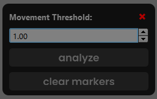

# ETimingTool: Maya Animation Timing Analysis

The ETimingTool script enhances animation workflows in Autodesk Maya by analyzing animation timing and creating visual bookmarks for stagnant periods. It assists animators by providing a clear visual representation of where in the timeline keyframes are dense or sparse, helping to refine animation timing and ensure smooth motion.



## Installation

1. Place the `ETimingTool.py` file in the `scripts` folder of your Maya directory.
2. Place the `ETimingTool` folder in the `prefs/icons` folder of your Maya directory.

## Usage

To launch the ETimingTool interface, execute the following Python commands in Maya's Script Editor or through the Python command line:

```python
import ETimingTool
ETimingTool.create_eTimingTool_window()
```

This command opens the ETimingTool window, allowing for direct interaction with the tool's features:

1. Select Animation Controls: Begin by selecting the controls for which you wish to analyze animation timing. These can be any animatable nodes in Maya that have keyframes.
2. Analyze Timing: With your controls selected, click the "Analyze" button. The script will calculate periods where animation stagnates — periods where there is little to no change in the animation — and automatically create visual bookmarks on the timeline for these periods. This process aids in identifying areas where the animation may require smoothing or additional keyframes.
3. Clear Bookmarks: If you need to remove all bookmarks created by the ETimingTool from the timeline, simply click the "Clear Markers" button. This will delete all bookmarks related to the script, allowing for a clean slate for further analysis or adjustments.
